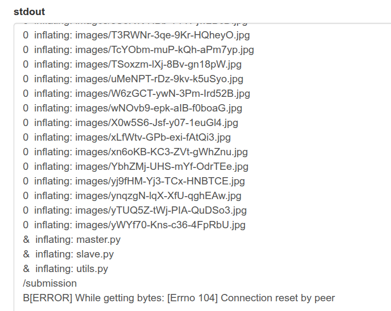
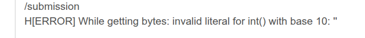
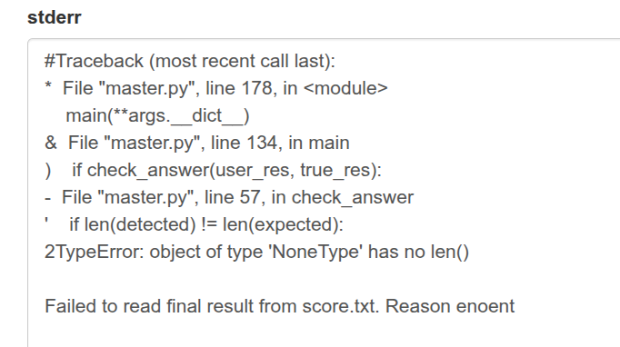

https://sim.avt.global/public/

В общем, на днях наткнулся на особенность работы платформы проверки решения.

Помимо того, что используемые пакеты должны соответствовать указанным версиям, само решение во время выполнения не должно превышать 500 МБ (возможно, другое значение) оперативной памяти.

И это очень актуально при решении задач на использование нейронных сетей, где сама модель может подходить под ограничение 30 МБ на диске, но её размер при работе программы может перевалить за допустимые значения.
Ошибка будет такого плана:

Поток вывода:



либо



Поток ошибок:



Для тестов рассмотрел задачу
## Обнаружение автомобилей
https://sim.avt.global/public/187

Загрузил решение от Василия Белкина
MyUltra.zip

И решение спокойно отработало (0.89), на локальных тестах модель использует 400 МБ оперативы.

Затем в файл eval.py было дописано
```python
# Запираем 500 мегабайт в куче процесса (1 байт на каждый байт = 500 * 1024^2).
# BYTEARRAY = непрерывный массив байт фиксированного размера, выделяется сразу.
# _BLOAT_MB - сколько мегабайт занять (меняй тут, чтобы проверить лимит платформы).
_BLOAT_MB = 500

# Список-хранилище: держит ссылку на bytearray, чтобы сборщик мусора (GC)
# НЕ удалил его. Пока объект жив в списке - память не освободится.
_bloat = []


def _bloat_memory():
    # global - чтобы изменять/читать модульную переменную _bloat, а не локальную копию.
    global _bloat
    # Если память уже выделена - выходим, не выделяем второй раз
    # (иначе каждый вызов добавлял бы ещё +500 МБ).
    if _bloat:
        return
    # bytearray(500*1024*1024) = 524 288 000 байт ≈ 500 МБ ОЗУ.
    # append() кладёт его в список _bloat -> объект живёт до конца процесса.
    _bloat.append(bytearray(_BLOAT_MB * 1024 * 1024))


```

и в функцию load_models был добавлен вызов _bloat_memory()

Полученное решение не заработало на платформе.

---
Вывод: граница оперативной памяти на платформе — примерно 500 МБ.

Кроме нейронных сетей, могут представлять угрозу задачи с обработкой видео.
Сохранение полученных кадров в массив с последующим анализом также может привести к исчерпанию памяти.